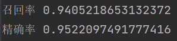
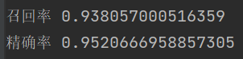

# JudgementProject

法律文书项目相关，主要实验方向有两个

1. 通过doc2vec抽取特征向量
2. 通过bert抽取特征向量

完成之后，通过分类模型和聚类模型查看方案可行性

## 1. 已/未完成任务

### 已完成

* 数据预处理(preprocess.py)
  1. 结巴（jieba）分词,对原文件分词
  2. 去除停用词（停用词文件cn_stopwords.txt)
* doc2vec 抽取段落特征向量 (doc2vec_model.py)
* bert模型抽取向量(bert2vec_model.py)
* 使用 bert+fine tuning 改进模型效果

### 未完成

* 前端展示分类效果

## 2. 阶段成果

主要分为分类和聚类两个方向的实验成果

### 2.1 分类方案实现

#### 实验过程

分类标签定义如下（按照文章从上到下）,目前标记的文章数为150，段落数共计4300

```python
LABELS = {1: "标题案号", 2: "当事人、辩护人、被害人情况", 3: "案件始末", 4: "指控", 5: "证实文件", 6: "辩护意见", 7: "事实", 8: "证据列举", 9: "判决结果", 10: "尾部", 11: "法律条文等附录"}
```

训练集和验证集按照8：2的比例划分

```
train_vec, test_vec, train_label, test_label = train_test_split(doc_vec_flatten, doc_labels_flatten, test_size=0.2)
```

分类方案共计两个方向

1. **方向1**：使用前置模型（doc2vec 或 bert）提取段落特征向量，输入到后续的分类模型进行训练
2. **方向2**：使用bert+fine tuning的方式，实现分类

------

#### 方向1：前置模型+分类模型

基于**doc2vec提取段落特征向量**的不同分类模型数据

|        分类模型        | 训练集准确率(accuracy) | 验证集准确率(accuracy) | 平均召回率（recall） | 平均精确率（precision） |
| :--------------------: | :--------------------: | :--------------------: | :------------------: | :---------------------: |
|    线性softmax分类     |       0.57-0.60        |          0.71          |         0.8          |          0.79           |
|          SVM           |          0.68          |          0.68          |         0.81         |          0.85           |
|         决策树         |          0.49          |          0.53          |         0.56         |          0.63           |
|        KNN分类         |        **0.64**        |          0.66          |         0.89         |          0.92           |
|        随机森林        |        **0.67**        |          0.67          |         0.93         |          0.95           |
|      极端随机森林      |          0.68          |          0.68          |         0.89         |          0.95           |
|   集成学习-Adaboost    |        **0.87**        |          0.54          |         0.74         |          0.87           |
| 集成学习-GradientBoost |        **0.97**        |          0.69          |         0.88         |          0.91           |

基于**bert提取段落特征向量**的不同分类模型数据

|        分类模型        | 训练集准确率(accuracy) | 验证集准确率(accuracy) | 平均召回率（recall） | 平均精确率（precision） |
| :--------------------: | :--------------------: | :--------------------: | :------------------: | :---------------------: |
|    线性softmax分类     |          0.72          |          0.72          |         0.83         |          0.79           |
|          SVM           |        **0.89**        |          0.87          |         0.92         |          0.95           |
|         决策树         |          0.75          |          0.79          |         0.77         |          0.78           |
|        KNN分类         |        **0.86**        |          0.85          |         0.94         |          0.95           |
|        随机森林        |        **0.86**        |          0.87          |         0.93         |          0.95           |
|      极端随机森林      |        **0.87**        |          0.85          |         0.93         |          0.94           |
|   集成学习-Adaboost    |        **0.98**        |          0.84          |         0.92         |          0.94           |
| 集成学习-GradientBoost |        **0.99**        |          0.87          |         0.94         |          0.94           |

#### 总结

1. 基于doc2vec提取特征向量不同模型的准确率在0.57-0.68左右，基于bert模型基本均在0.85以上，比较之下bert提取特征效果更优

2. 不同机器模型中，分类效果较好的主要是SVM，极端随机森林，基于bert提取的准确率从能够达到0.87
3. 两个集成学习方法出现了过拟合问题，可能原因是训练数据量不够，如果数据量足够，效果**可能优于**其他模型


#### 方向二

训练准确率能够达到90%以上


#### 结论

当前实验方向最好的方案为 **bert+ 极端随机森林**，准确率能够接近0.9。


### 2.2 聚类方案实现

#### 实验过程

- 预处理+doc2vec/bert 抽取段落向量

- kmeans 聚类（cluster_solution.py）

  1. 根据标注预期选择了6, 7, 8, 9, 10, 11的不同聚类数量kernel，进行实验
  2. 分别训练不同kernel的kemeans模型，通过轮廓系数和平均距离，确定选择kernel=9的聚类模型
  3. 每个类别随机抽取100个段落，分析对应类别特征

#### 结果分析

1. **class_0**：涉及诈骗案件的指控，判决，查明部分（最长的那几个段）
2. **class_1**：涉及肇事，伤人类型案件的指控，判决，查明部分
3. **class_2**：涉及毒品赌博的指控，判决，查明部分
4. **class_3**：涉及金额类型的证据，证言
5. **class_4**:  涉及公司，金钱案件的指控，判决，查明部分
6. **class_5**：除金额类型外的证据，证言
7. **class_6**：开头结尾废话部分(审判员，辩护人，判决书题目，日期的)
8. **class_7**：判决书最后的法律条款部分
9. **class_8**：没太看出来和其他的区别，但主要是指控，判决，查明部分

#### 总结

1. 涉及个人信息的段落聚类，段落的案件信息会影响聚类结果，导致与按照结构分类目标不符合，所以会出现class_0,class_1,class_2,class_4,class_8四个相似分类
2. 不涉及具体案件信息的段落聚类效果较好，class_3，class_5，class_6，class_7


## 3. 附录

### 1. 分类方案实现方向1，实验结果记录

1. **线性softmax分类模型**

   * **doc2vec + softmax**  准确率在0.57-0.60之间,平均召回率和精确率分别为0.51和0.58

     

     

     

2. **SVM模型**

   * **doc2vec + SVM**   准确率在0.68左右，平均召回率和精确率分别为0.81和0.85

     

     

   * **bert+SVM**  准确率提高了0.3

     

     

3. **决策树模型**

   * **doc2vec + 决策树模型**   效果不如SVM模型

     

     

   * **bert+决策树模型** 

     

     

4. **KNN分类模型**

   * **doc2vec + KNN分类模型** 效果比较好

     

     

   * **doc2vec+KNN分类模型**

     

     

5. **随机森林分类模型**

   * **doc2vec + 随机森林分类模型**  效果优于KNN

     

     

   * **bert+随机森林** 

     

     

6. **极端随机森林分类模型**

   * **doc2vec + 极端随机森林分类模型**  效果最好的机器学习模型

     

     

   * **bert+计算随机森林分类** 

     

     

7. **集成学习-Adaboost**

   * **doc2vec + Adaboost 以决策树作为基分类器** 出现了过拟合问题

     

     

   * **bert + Adaboost 以决策树作为基分类器**

     

     

8. **集成学习-GradientBoost**

   * **doc2vec + GradientBoost**  出现了过拟合问题

     

     

   * **bert + GradientBoost** 

     

     
