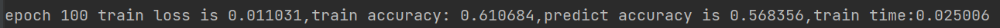
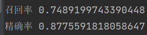
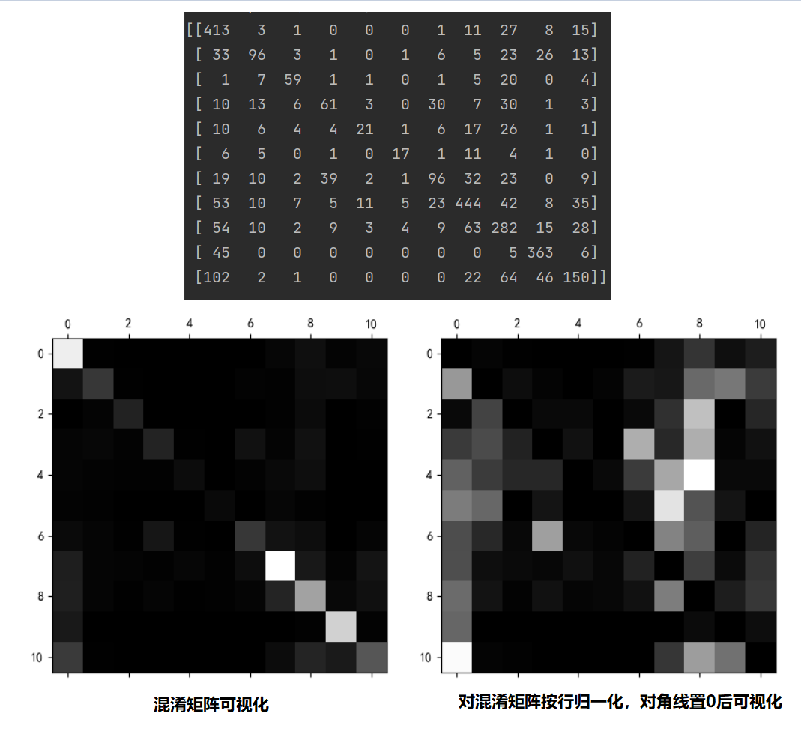

# JudgementProject

法律文书项目相关，主要实验方向有两个

1. 通过doc2vec抽取特征向量
2. 通过bert抽取特征向量

完成之后，通过分类模型和聚类模型查看方案可行性

## 1. 已/未完成任务

### 已完成

* 数据预处理(preprocess.py)
  1. 结巴（jieba）分词,对原文件分词
  2. 去除停用词（停用词文件cn_stopwords.txt)
* doc2vec 抽取段落特征向量 (doc2vec_model.py)
* bert模型抽取向量(bert2vec_model.py)

### 未完成

* 尝试使用 bert+fine tuning 改进模型效果

## 2. 阶段成果

主要分为分类和聚类两个方向的实验成果

### 2.1 分类方案实现

#### 实验过程

分类标签定义如下（按照文章从上到下）,目前标记的文章数为150，段落数共计4300

```python
LABELS = {1: "标题案号", 2: "当事人、辩护人、被害人情况", 3: "案件始末", 4: "指控", 5: "证实文件", 6: "辩护意见", 7: "事实", 8: "证据列举", 9: "判决结果", 10: "尾部", 11: "法律条文等附录"}
```

训练集和验证集按照8：2的比例划分

```
train_vec, test_vec, train_label, test_label = train_test_split(doc_vec_flatten, doc_labels_flatten, test_size=0.2)
```

分类方案共计两个方向

1. **方向1**：使用前置模型（doc2vec 或 bert）提取段落特征向量，输入到后续的分类模型进行训练
2. **方向2**：使用bert+fine tuning的方式，实现分类

#### 方向1：前置模型+分类模型

1. **线性softmax分类模型**

   * **doc2vec + softmax**  准确率在0.57-0.60之间,平均召回率和精确率分别为0.51和0.58

     

     

   * 

2. **SVM模型**

   * **doc2vec + SVM**   准确率在0.68左右，平均召回率和精确率分别为081和0.85

     

   

3. **决策树模型**

   * **doc2vec + 决策树模型**   效果不如SVM模型

     
  
     

4. **KNN分类模型**

   * **doc2vec + KNN分类模型** 效果比较好

     
   
   ​		
   
5. **随机森林分类模型**

   * **doc2vec + 随机森林分类模型**  效果优于KNN

     

     

6. **极端随机森林分类模型**

   * **doc2vec + 极端随机森林分类模型**  效果最好的机器学习模型

     

     

7. **集成学习-Adaboost**

   * **doc2vec + Adaboost 以决策树作为基分类器** 出现了过拟合问题

     

     

8. **集成学习-GradientBoost**

   * **doc2vec + GradientBoost ** 出现了过拟合问题

   

   


### 2.1 聚类方案实现

#### 实验过程

- 预处理+doc2vec/bert 抽取段落向量

- kmeans 聚类（cluster_solution.py）

  1. 根据标注预期选择了6, 7, 8, 9, 10, 11的不同聚类数量kernel，进行实验
  2. 分别训练不同kernel的kemeans模型，通过轮廓系数和平均距离，确定选择kernel=9的聚类模型
  3. 每个类别随机抽取100个段落，分析对应类别特征

#### 结果分析

1. **class_0**：涉及诈骗案件的指控，判决，查明部分（最长的那几个段）
2. **class_1**：涉及肇事，伤人类型案件的指控，判决，查明部分
3. **class_2**：涉及毒品赌博的指控，判决，查明部分
4. **class_3**：涉及金额类型的证据，证言
5. **class_4**:  涉及公司，金钱案件的指控，判决，查明部分
6. **class_5**：除金额类型外的证据，证言
7. **class_6**：开头结尾废话部分(审判员，辩护人，判决书题目，日期的)
8. **class_7**：判决书最后的法律条款部分
9. **class_8**：没太看出来和其他的区别，但主要是指控，判决，查明部分

#### 总结

1. 涉及个人信息的段落聚类，段落的案件信息会影响聚类结果，导致与按照结构分类目标不符合，所以会出现class_0,class_1,class_2,class_4,class_8四个相似分类
2. 不涉及具体案件信息的段落聚类效果较好，class_3，class_5，class_6，class_7


* 在整个数据集上，进行混淆矩阵分析(行为真实标签,列为预测标签)

  

  1. 左下图可得，label = {1，8， 9 ， 10} 分类效果较好，分类错误数量较少；其余标签分类效果较差
  2. 右下图可得，大量的其他标签段落错误分类为{1， 2， 8， 9}，其中label = 5  证实文件段落分容易分类为label = 9 判决结果段落；label = 6 辩护意见段落分容易分类为 label = 8 证据列举段落；label = 11 法律条文等附录段落分容易分类为 label = 1 标题案号段落

#### 总结

* 目前分类效果还比较一般，可能是由于：
  1. 标记数据还比较少
  2. 分类模型不够有效
  3. doc2vec特征提取能力一般
* 下一步解决方案：
  1. 继续标注数据
  2. 学习决策树和集成学习，实现另外的分类算法，改进分类效果
  3. bert模型提取特征向量（还是没想好）
