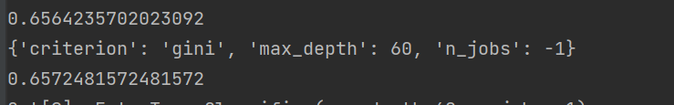
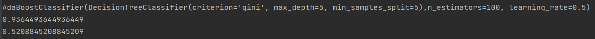
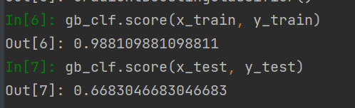
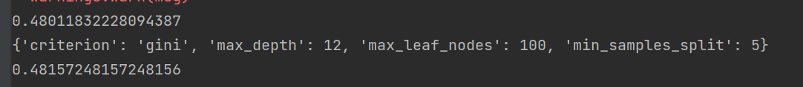
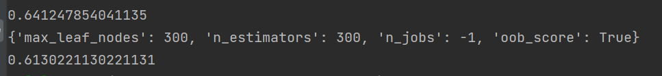
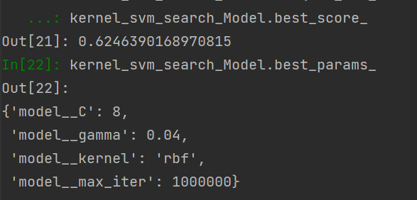

### 7.10

1. 今日完成
   * 增加了50篇标注数据，机器学习分类算法准确度有所提升
2. 明日计划
   1. 使用CLS作为句子的特征向量，替代doc2vec测试机器学习模型效果
   2. 使用hugging face的BertForSequenceClassification，尝试fine tuning
3. 问题
   1. 截断长度设置为多少？ 目前计划150-200之间
   2. fine tuning 的batchsize 和设备要求？ 先试试，不行就用服务器
   3. 具体使用哪个中文bert模型？目前准备bert-base-chinese和hfl/chinese-bert-wwm-ext

### 7.9

1. 今日完成

   * 极端随机森林，准确率在0.65-0.67之间

     

   * 集成学习方法-AdaBoost模型

     * 数据量不够，太容易过拟合，限制拟合程度的话，效果跟决策树区别不大

       

   * 集成学习方法-GradientBoost模型

     * 与Adaboost同样的问题

       

### 7.8

1. 今日完成

   * 尝试了决策树模型，分类效果一般，准确率不到0.5

     

   * 尝试了KNN分类，准确率基本稳定在0.62

     

   * 随机森林分类，准确率在0.62-0.64之间
     

### 7.7

1.今日完成

  * 尝试了SVM模型，并通过网格搜索确定了可能的最优结果，准确率略微优于softmax分类模型

    

### 6.27

1.今日完成

  * 实现了基于pytorch的连接层+softmax分类算法

2.待解决问题

  * 分类标签问题还未处理

### 6.22

1.今日完成

  * 完成了 doc2vec 抽取特征向量()
  * 确定了文件组织形式

2.待解决问题

  * doc2vec 超参数如何确定
  * 抽取效果一般